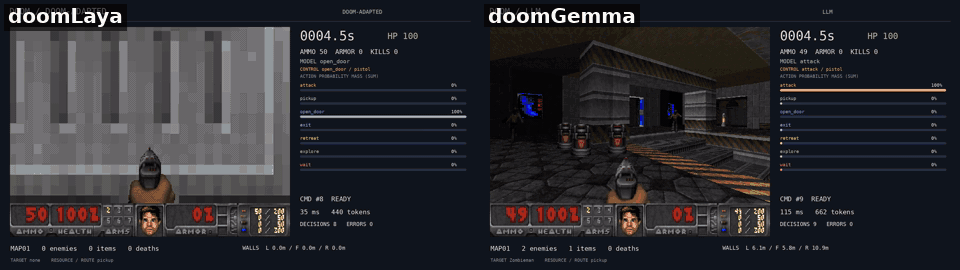

# doomGemma — Laya vs Gemma on Doom: tests of the Laya "System One" decision model against fine-tuned LLMs

> **This repository contains the full test suite for Laya** (Laya v3 for Doom, Laya base and Laya typed-decisions) **and for Gemma** (4 E2B and 3 270M, zero-shot and with LoRA), all run in the doomLaya FreeDoom agent: validation accuracy, calibration, latency on the same GPU, games on MAP01 and MAP02, and the rule-based teacher as a reference player.

**Can a small generative LLM, fine-tuned with LoRA on exactly the same data, match a
"System One" decision model?** This repository compares
[Laya v3](https://huggingface.co/azalio/laya-doom-v3) (a 421M non-autoregressive
encoder, from [azalio/doomLaya](https://github.com/azalio/doomLaya)) with **Gemma 4 E2B**
and **Gemma 3 270M**, each trained with a LoRA on the **same 979 labelled decisions**, in
the same FreeDoom agent, on the same hardware.



*Left: Laya v3. Right: Gemma 4 E2B + LoRA. Same map, same seed, same moment; the side
panel shows each model's choice and option probabilities.*

## Summary

With the same 979 examples, a **27-minute LoRA** on one RTX 4070 brings Gemma 4 E2B to
Laya v3's level in play (6/6 vs 6/6 exits on MAP01) and above it on single decisions.
At **equal size** a decoder is as fast as Laya (22 vs 23 ms); at **equal in-game
result** Laya is still about 3× faster. On a new map nobody exits, **not even the
rule-based teacher** that produced the labels: on this bench, generalisation cannot be
measured.

| (RTX 4070) | validation command / weapon | MAP01 exits (seeds 48–53) | mean exit time | p50 latency |
|---|---|---|---|---|
| Laya v3 (421M encoder) | 0.725 / 0.98 | 6/6 | 59.5 s | 23 ms |
| **Gemma 4 E2B + LoRA** | **0.96 / 1.00** | 6/6 | 60.0 s | 59 ms (llama.cpp) |
| Gemma 3 270M + LoRA | 0.89 / 1.00 | 2/6 | 68.5 s | **22 ms** (direct PyTorch) |
| rule-based teacher (label source) | — | 6/6 | 81.6 s | < 1 ms |
| Gemma 4 E2B zero-shot | 0.51 / 0.78 | 0/1 | — | 59 ms |
| Laya base / typed-decisions, zero-shot | 0.41 / 0.58 · 0.40 / 0.60 | 0/1 · 0/1 | — | 24 ms (base) |

Main findings (details, calibration, "rails" and all caveats in
[docs/RESULTS.md](docs/RESULTS.md); Italian version in [docs/RISULTATI.md](docs/RISULTATI.md)):

1. **Task training matters more than architecture.** Zero-shot, Gemma E2B already beats
   both Laya checkpoints; after LoRA on the same data it matches Laya v3 in play and beats
   it on single decisions and calibration (ECE 0.04 vs 0.06).
2. **Latency on two planes.** At equal size there is no intrinsic speed advantage of the
   "System One" architecture (270M decoder 22 ms vs Laya 23 ms). At equal in-game result
   Laya is ~3× faster, because it gets there with a smaller model. The game asks for a
   decision every 0.5 s, so this bench does not stress latency.
3. **Per-question accuracy does not predict play.** The 270M adapter scores 0.89 on
   validation but exits 2/6: the executor rejects its commands 60% of the time.
4. **Zero-shot LLMs are over-confident** (Gemma E2B ECE 0.38, probability 1.00 even when
   wrong); after task training they are the best calibrated of the group.
5. **The models exit faster than their teacher** (~60 s vs 82 s) because they imitate it
   imperfectly and pick up fewer items; the teacher does not optimise time-to-exit.
6. **Generalisation is not measurable here.** On MAP02 nobody exits, teacher included: the
   chain stops at a **yellow-key door** (sector 37, linedef special 27, verified in the
   WAD with `src/verifica_porta.py`) that doomLaya offers as openable while the key is far
   and out of sight.

## Models

- [dexmac/doomgemma-e2b-lora](https://huggingface.co/dexmac/doomgemma-e2b-lora): Gemma 4 E2B + LoRA (97 MB)
- [dexmac/doom-gemma3-270m-lora](https://huggingface.co/dexmac/doom-gemma3-270m-lora): Gemma 3 270M + LoRA (15 MB)

## Repository layout

| path | content |
|---|---|
| `patches/doomLaya-agent.patch` | 6 lines changed in doomLaya's `agent.py` (5 added, 1 modified): `--model llm` (any llama.cpp model through `src/serve_llm.py`) and `--model oracolo` (the rule-based teacher as player) |
| `src/serve_llm.py` | bridge with Laya's `/predict` API: options → letters, grammar-constrained single token, probabilities from `top_logprobs` |
| `src/oracolo.py` | the labelling rules (`gold`, copied verbatim from doomLaya's `training/build_dataset.py`) as a player |
| `src/lora_train.py`, `src/lora_fondi.py` | LoRA training (loss on the answer letter only) and merge for GGUF conversion |
| `src/valuta.py`, `src/calibra.py` | accuracy and calibration (ECE, Brier, 2-fold temperature scaling) on the 130 validation questions |
| `src/latenza.py`, `src/latenza_diretta.py` | latency on replayed game packets: through a server, and direct PyTorch scoring |
| `src/semi.sh`, `src/gioca.sh`, `src/binari.py`, `src/confronta.py` | games over seeds/maps, executor-rejection share, decision patterns |
| `src/verifica_porta.py` | reads `freedoom2.wad` and identifies the MAP02 door |
| `results/` | raw results (JSON / JSONL) and training histories |
| `docs/RESULTS.md` | full write-up: method, all tables, limitations, prior work (Italian: `docs/RISULTATI.md`) |

Script comments and result keys are in Italian (*uscita* = exit, *morti* = deaths,
*freddo* = zero-shot, *raccolti* = items picked up).

## Reproducing

```bash
git clone https://github.com/azalio/doomLaya && cd doomLaya
git checkout b25edd3
git apply /path/to/doomgemma/patches/doomLaya-agent.patch
cp /path/to/doomgemma/src/* .
# set up doomLaya's environment as in its README, then e.g.:
llama-server -m doomgemma-e2b-Q8_0.gguf -ngl 999 -fa on -np 2 -c 8192 --jinja --port 8090 &
python serve_llm.py --llm http://127.0.0.1:8090 --name e2b-doom --port 8002 --separate &
python valuta.py http://127.0.0.1:8002/predict llm
MAPPA=MAP01 SECONDI=180 bash semi.sh llm http://127.0.0.1:8002/predict e2b-doom 48 49 50 51 52 53
MAPPA=MAP02 SECONDI=300 bash semi.sh oracolo http://127.0.0.1:9/predict oracolo 48 49 50
```

To build the GGUF from the adapter: merge it into the base model with
`src/lora_fondi.py`, then `convert_hf_to_gguf.py` and `llama-quantize … Q8_0` from llama.cpp.

Environment used: Ryzen 5 5600X, RTX 4070 12 GB + RTX 2070 SUPER 8 GB, Ubuntu 24.04,
ViZDoom 1.3.1, torch 2.14 (CUDA 13.0), transformers 5.17, peft 0.21, llama.cpp `7077abbe1`.

## Limitations

Training and validation are on MAP01 only; MAP02 turned out to be unsolvable by the whole
chain. The validation set is small (130 questions). Labels come from a rule-based teacher,
not from human play. Laya v3 was trained by its authors with a different recipe and was
not re-tuned here. Jev numbers are quoted from doomLaya and not reproduced. The Gemma 3
270M base was taken from the `unsloth/gemma-3-270m-it` mirror because Google's repository
is gated. See `docs/RESULTS.md` §7 for the full list.

## Credits and licences

- Code in this repository: Apache-2.0 (see `LICENSE`, `NOTICE`).
- [azalio/doomLaya](https://github.com/azalio/doomLaya): harness, training data and Laya v3, Apache-2.0.
- [Laya](https://huggingface.co/convaiinnovations/laya) by Convai Innovations, Apache-2.0.
- Gemma models by Google, under the [Gemma Terms of Use](https://ai.google.dev/gemma/terms).
- FreeDoom and ViZDoom under their own licences.
